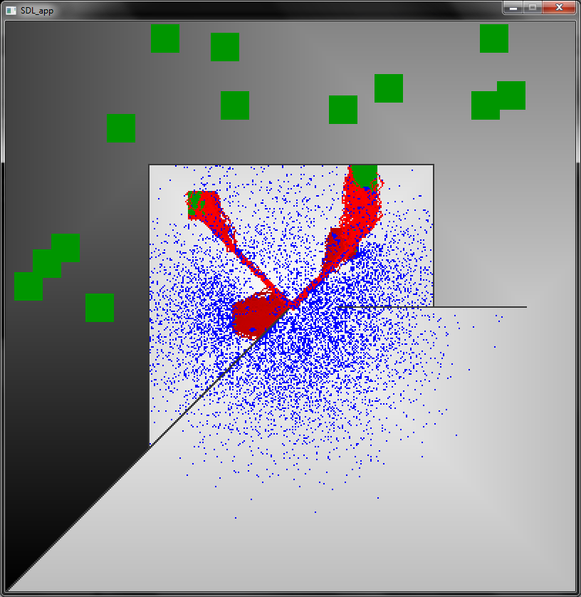
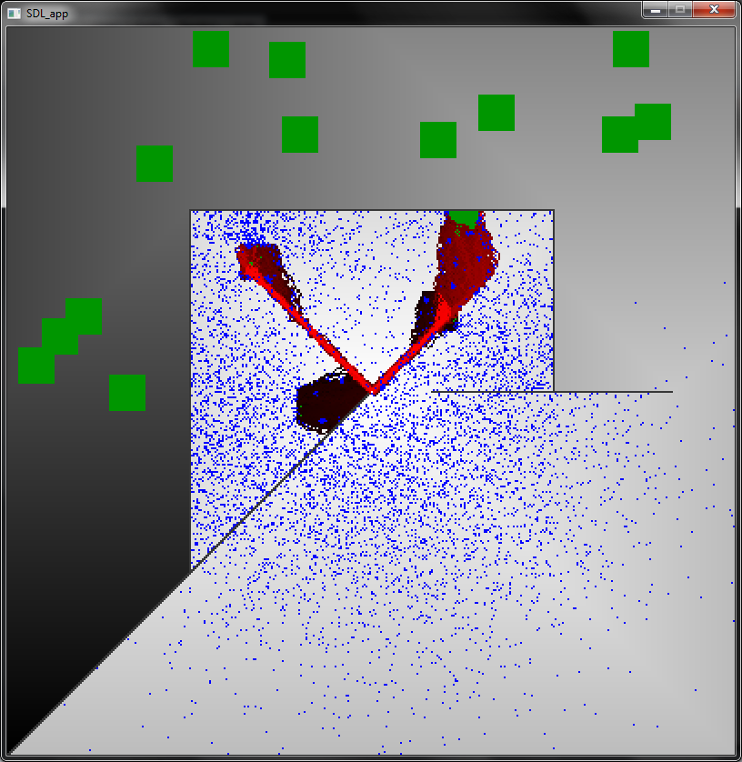
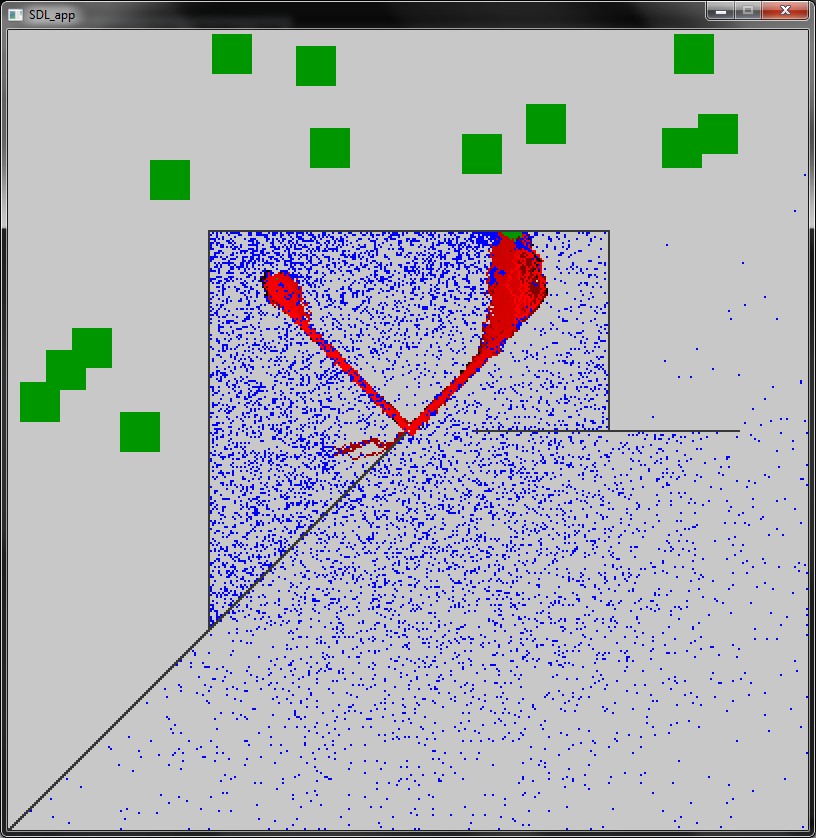
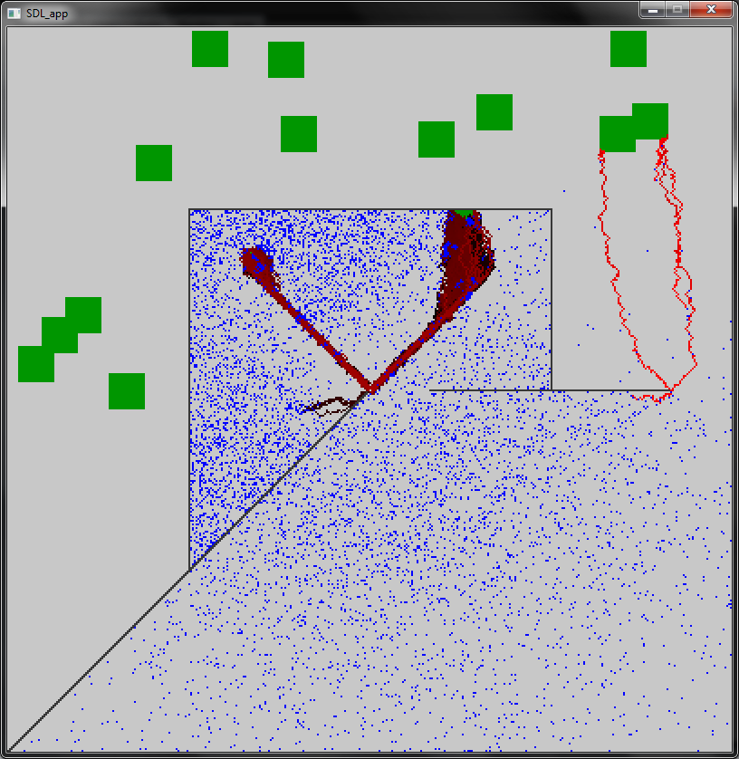

Pheromones
==========


This project is a Simple ant colony simulation for illustrating path selection using pheromones. It is written in C and graphics are generated using the SDL library.

Description
-----------
Ants are indiviudal agents that can only communicate indirectly by releasing a small amount of pheromone at a specific location. Ants move randomly, and if possible, can follow a pheromone trail towards the descending values of concentration (so as to go to the source of it). If an ant finds some food, it brings it back to nest (the path to the nest is assumed to be known).

The pheromone concentration is spreading over time and can be reenforced by ants that have found food and carry it back to the nest, or it slowly evaporates otherwise. **This system reveals an emergent behaviour: the path to the nearest spot of food is naturally selected** without any global awareness of the map, direct communication between the ants, and more interstingly, no computation by any single agent of the global problem.


Screenshots (chronological order)
-----------







Installation
------------

For OSX:
```
brew install sdl
git clone https://github.com/mbellier/pheromones.git
make
./main
```
